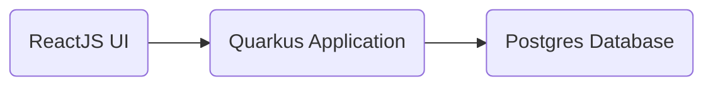

# Bunnyshell Hackaton

This is a full-stack web application that is a basic User Management Application with CRUD features:

 - Create User 
 - List User 
 - Update User 
 - Delete User
 
## Application Flow Diagram

## Technologies used:

### Back-End:

-   Java 17
-   Quarkus 3.1.0.Final
-   Postgres Database (v15.3)
-   Hibernate Panache

### Front-End:

-   React-router-dom 5+
-   Axios 1.4.0
-   Bootstrap 4.5.0

## Images Used

 - [Redhat UBI9 OpenJDK 19](https://catalog.redhat.com/software/containers/ubi9/openjdk-17/61ee7c26ed74b2ffb22b07f6)
 - [Node 18 LTS Alpine](https://hub.docker.com/layers/library/node/18.12-alpine3.17/images/sha256-b375b98d1dcd56f5783efdd80a4d6ff5a0d6f3ce7921ec99c17851db6cba2a93?context=explore)
 - [Postgres 15.3 Alpine](https://hub.docker.com/layers/library/postgres/15.3-alpine3.18/images/sha256-58a4e7ae605e8e247180ebba1cc3758ab20677e9a5221ab3150a74f47938b8a1?context=explore)

## User Interface

### Add User

### Retrieve All User

### Retrieve Specific User

### Update User

## Swagger (Rest API)

The swagger UI is available at http://localhost:8080/swagger-ui.html 

